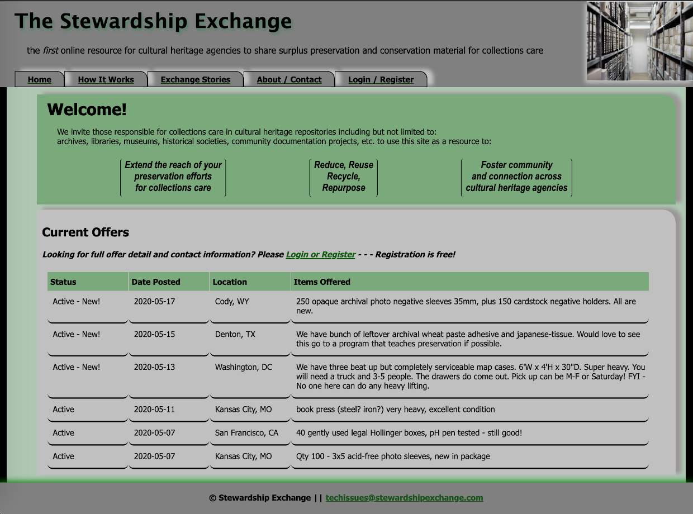
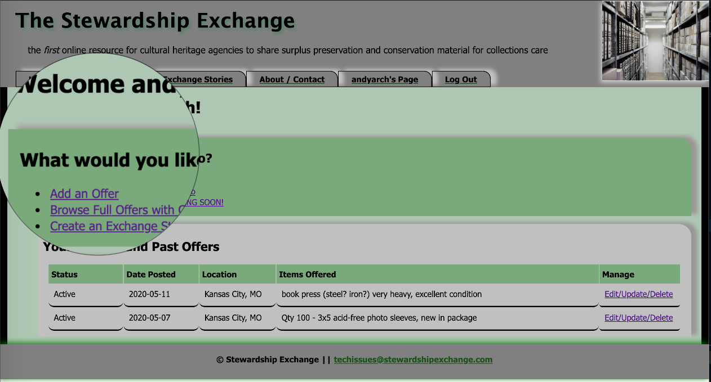
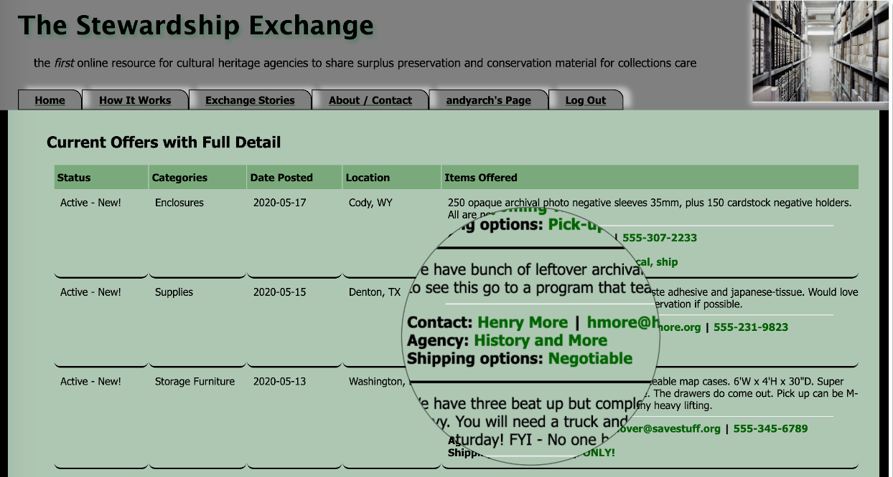

# Stewardship Exchange

## Description

Duration: 2 week sprint

The STEWARDSHIP EXCHANGE is a free online resource for cultural heritage agencies to share surplus preservation and conservation material for collections care. Repositories typically have a surplus of new or gently used enclosures, supplies, tools, equipment, and furnishings that still have a useful life. Reducing, reusing, recycling, and repurposing helps save precious budget dollars for these non-profit organizations. This site aims to provide a communication forum for the collections care community to offer and claim these materials and as a by-product, foster new relationships, expanding professional networks. Registered users can create new offers, edit their offers, and create an Exchange Story to celebrate a successful transaction.

To see the fully functional site, please visit: DEPLOYED VERSION OF THE APP

## Screen Shots

The main page introduces the concept and previews current surplus offers

Logged in users have their own Home Page

Logged in users can access contact and additional information for active offers

## Prerequisites

To run the project - link these

Postgres
Node.js

## Installation

How do I get the project up and running on my machine

1. Create database
2. Queries
3. Open editor

## Usage

How the user interact with the site - tell a user story "as an admin, as a visitor, as a registered user..."

## Built With

### TECHNOLOGIES

- JavaScript
- HTML
- CSS
- Axios
- Node.js with Express
- React with Redux & Redux-Saga
- React Router Dom
- PostgreSQL
- Heroku

### DEVELOPMENT TOOLS

- Visual Studio Code
- Nodeman
- Postman
- Postico

## License

MIT - optional open source

## Acknowledgement

Thanks to [Prime Digital Academy](https://www.primeacademy.io/) and my cohort peers for guiding me though the fundamentals of full stack development, providing me with a solid foundation in modern technologies, and their continued support in my development as a software engineer.

## Feedback, Suggestions, Support

Please reach out to [learn2code@respectdesfonds.com](mailto:learn2code@respectdesfonds.com) if you have comments, ideas, or interest in contributing to this project
